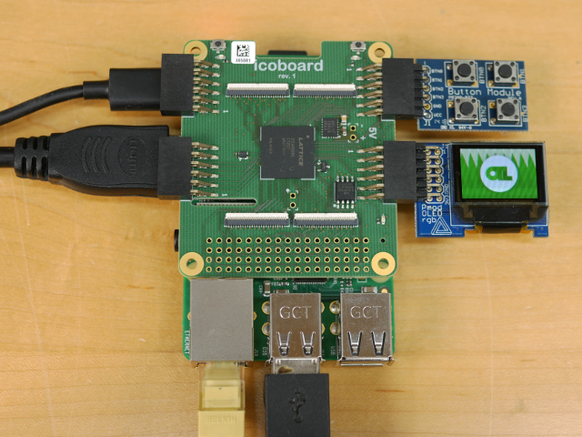

otl-icoboard-pmodrgboled-demo
=============================



*otl-icoboard-pmodrgboled-demo* is a simple demo for the
[IcoBoard](http://icoboard.org) FPGA board for the
[RasberryPI](https://www.raspberrypi.org/) involving the
[PmodOLEDrgb](https://reference.digilentinc.com/reference/pmod/pmodoledrgb/start),
which is synthesized using the [IceStorm](http://www.clifford.at/icestorm/)
tool-chain; a fully open-source synthesis tool-chain for the
[Lattice ICE40HX8K](http://www.latticesemi.com/Products/FPGAandCPLD/iCE40.aspx)
FPGA.

This demo was produced as part of a video-demonstration of the IcoBoard and the
IceStorm tools featured on the [OpenTechLab](https://opentechlab.org.uk/)
YouTube channel.

The PmodOLEDrgb is a Pmod (plug-in module) featuring a 96×64-pixel
16-bits-per-pixel colour OLED display, driven by the
[Solomon Systech SSD1331](https://cdn-shop.adafruit.com/datasheets/SSD1331_1.2.pdf)
display controller, which is controlled by the FPGA through a Mode-3
[SPI](https://en.wikipedia.org/wiki/Serial_Peripheral_Interface_Bus) slave
interface, via Pmod port #1 on the IcoBoard.

This demo firmware sends full frame-buffer video images at 60-FPS from a
selection of video sources, including:

 * Video imagery sourced from block-RAM. At start-up the block-RAM is
   pre-populated with a static image. The contents of the block-RAM can also be
   replaced by the RasperryPI on a one-shot or repeated basis with stream-tool,
   so that still or moving images can be displayed on the screen (see below).
 * Pseudo-random video noise generated on-the-fly by a 20-bit
   [Linear-feedback Shift Register (LFSR)](https://en.wikipedia.org/wiki/LFSR).
 * A video hack that produces a moving multi-coloured pattern.
 * A video hack that fills the screen with a binary counter made of blocks.

The different inputs are selected by button presses to a
[PmodBTN](https://reference.digilentinc.com/reference/pmod/pmodbtn/start) - a
Pmod featuring 4× hardware debounce filtered tactile switches, connected to
Pmod port #2 on the IcoBoard.

Build Requisites
----------------

The following tools must be installed...

 * [IceStorm tool-chain](http://www.clifford.at/icestorm/) - needed for synthesis.
   * [Yosys](http://www.clifford.at/yosys/)
   * [IceStorm](http://www.clifford.at/icestorm/)
   * [arachne-pnr](https://github.com/cseed/arachne-pnr)
 * [FFmpeg](http://ffmpeg.org/) - needed for 16-bit image conversion and video
   streaming with *stream-tool*.
 * [icoprog](https://github.com/cliffordwolf/icotools/tree/master/icoprog) from
   within the icotools repository - needed to load the bitstream into the
   IcoBoard.
 * [Icarus Verilog](http://iverilog.icarus.com/) - needed for simulation.
 * [GTKWave](http://gtkwave.sourceforge.net/) - needed for visualization of
   simulation results.

Synthesize Bitstream, and Run
-----------------------------

To synthesize bitstream...
```
$ cd fw/
$ make
```
Output is stored in `demo.bin`.

To program the bitstream into the IcoBoard...
```
$ icoprog -p < demo.bin
```

Run Simulation
--------------

```
$ cd fw/
$ make simulate-XXX
```
...where the available simulations are:

 * simulate-pmodoledrgb_controller
 * simulate-spi_ram_slave

Results will be displayed in GTKWave.

Stream Imagery
--------------
*stream-tool* is a simple C utility that reads frames from stdin, and sends
them through SPI, in frame-buffer-sized messages.

### Compile
```
$ cd stream-tool
$ make
```

### Enable SPI interface
Run `sudo raspi-config`, and enable the *SPI Interface* wthin the *Interfacing
Options* menu.

### Stream Video
*ffmpeg* can be used to transcode video files into a 96×64 RGB565 raw video stream...
```
$ ffmpeg -re -i /path/to/video.mkv -s 96x64 -an -f rawvideo -pix_fmt rgb565 - | \
    ./stream-tool
```

Alternatively, video can be streamed from a USB WebCam, or other V4L2 source...
```
$ ffmpeg -f v4l2 -i /dev/video0 -s 96x64 -f rawvideo -pix_fmt rgb565 - | \
    ./stream-tool
```
...where `/dev/video0` is the device-node of the video source.
